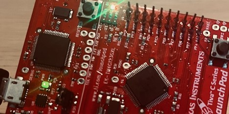

# TM4C123 RTOS Demo with QP/C (QXK + Semaphore + GPIO IRQ)

A compact embedded RTOS example on the **EK-TM4C123GXL** (Cortex-M4F) using the **QP/C framework (QXK kernel)**.  
It blinks the green LED continuously while responding to SW1 presses by flashing the blue LED briefly, demonstrating interrupt-based event signaling, thread synchronization via semaphores, and basic LED control.

---

## Repository Layout

|  
├── Application/                 # Your application logic (main, bsp)  
|  
├── CMSIS/               		 # CMSIS core headers  
|  
├── ek-tm4c123gxl/               # Board/Microcontroller-specific files  
|  
├── QPC/                         # QP/C framework + QXK port files  
|  
├── targetConfig/                # Target Configurations  

---

## Build & Run Instructions

### Prerequisites

- **Code Composer Studio (CCS)** or GCC ARM toolchain  
- **TivaWare SDK** (not included in repo)  
- **QP/C** is included under `QPC/` in this repo
- CMSIS headers (either from this repo or your local installation)  

### To Build:  

1. **Import project**:
   - `File → Import CCS Projects` → point to repo root
2. **Tivaware path setting**:
	-When prompted, set build variable in Project Properties → C/C++ Build → Build Variables:
		•	Name: TIVAWARE_ROOT
		•	Value: your TivaWare path (e.g. C:/ti/TivaWare_C_Series-2.2.0.295)
3. **Build and flash** — connect the LaunchPad, flash via CCS.
   		•	Connect the LaunchPad via USB
		•	Click the debug icon or Run → Debug to flash and start execution.

## License & Credits

	- Main application code: MIT (see `LICENSE.txt`)
	- Third-party components and their licenses: see `THIRD_PARTY_NOTICES

## Author
**Alexandre Panhaleux**  
Embedded Software Engineer  
[GitHub: @alexandrephl](https://github.com/alexandrephl)
